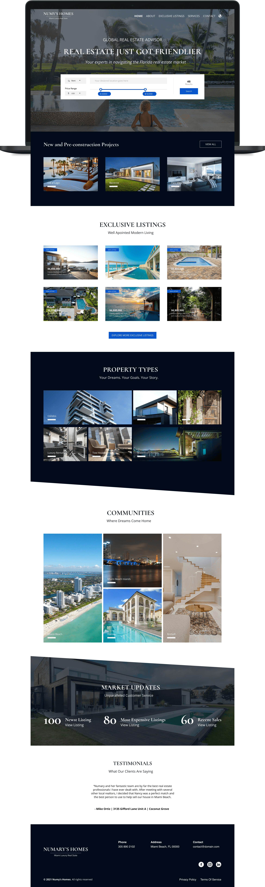

# Numy's Homes - Website

[![npm][npm]][npm-url]
[![node][node]][node-url]

This repository contains Numy's Homes Miami Luxury Real State's front-end code.



> Front-End workflow using Webpack, PUG, SASS, SMACSS-ITCSS, BEM, PostCSS & Babel.

## ⚙️ Installation

Clone the repository to access all project history:

```sh
git clone https://github.com/erwinfriasmtz/numy-website.git
```

Once the repository was cloned, open directory location from console and install node packages:

```sh
 npm install
```

## 🍻 Contributors

| Name                                                           | Position                                   |
|:---------------------------------------------------------------|:-------------------------------------------|
| [Erwin Alan Frías Martínez](https://github.com/erwinfriasmtz)  | Product Designer & Front-End Developer     |
| [Daniel Molina](https://github.com/Danielmolina5)              | UI Designer                                |


### ⚖️ Copyright and License

**© 2021 Numy's Homes**. All rights reserved

[npm]: https://img.shields.io/npm/v/webpack.svg
[npm-url]: https://npmjs.com/package/webpack

[node]: https://img.shields.io/node/v/webpack.svg
[node-url]: https://nodejs.org

